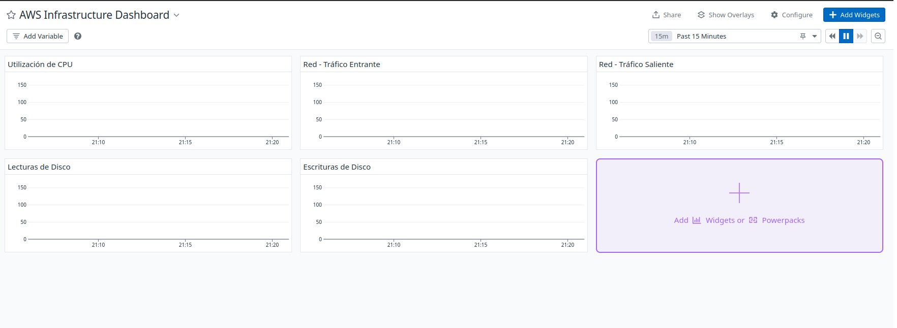
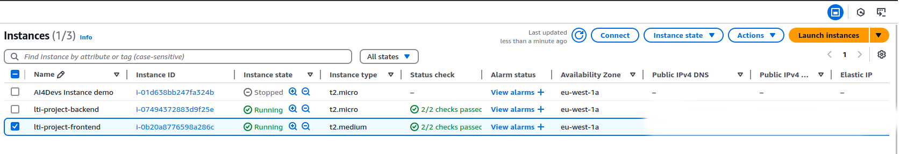

# Documentación de Cambios en la Infraestructura

## Introducción

Este documento detalla los cambios realizados en la infraestructura de AWS utilizando Terraform. Se han implementado mejoras en la configuración de instancias EC2, políticas de IAM, y monitoreo con Datadog para optimizar el rendimiento y la seguridad de los servicios de backend y frontend.

## Tabla de Contenidos

1. [Configuración de Instancias EC2](#1-configuración-de-instancias-ec2)
2. [Políticas de IAM](#2-políticas-de-iam)
3. [Configuración de Red](#3-configuración-de-red)
4. [Monitoreo con Datadog](#4-monitoreo-con-datadog)
5. [Gestión de Archivos S3](#5-gestión-de-archivos-s3)
6. [Seguridad](#seguridad)
7. [Retos Encontrados](#retos-encontrados)
8. [Captura del Dashboard de Datadog](#captura-del-dashboard-de-datadog)
9. [Captura de las Instancias EC2](#captura-de-las-instancias-ec2)
10. [Conclusiones](#conclusiones)

## 1. Configuración de Instancias EC2

- **Archivo:** `tf/ec2.tf`
- **Cambios Realizados:**
  - Se han definido instancias EC2 para el backend y frontend, especificando el tipo de instancia y los scripts de inicialización.
  - Se han asignado Elastic IPs para asegurar direcciones IP públicas estables.

- **Pseudocódigo:**
  ```plaintext
  definir instancia EC2 "backend" {
    tipo_instancia = "t2.micro"
    ami = "ami-xxxxxx"
    user_data = "script de inicialización"
    elastic_ip = asignar
  }

  definir instancia EC2 "frontend" {
    tipo_instancia = "t2.medium"
    ami = "ami-xxxxxx"
    user_data = "script de inicialización"
    elastic_ip = asignar
  }
  ```

## 2. Políticas de IAM

- **Archivo:** `tf/iam.tf`
- **Cambios Realizados:**
  - Se ha creado una política de acceso a S3 para permitir que las instancias EC2 descarguen archivos desde un bucket S3.
  - Se ha configurado un rol de IAM y un perfil de instancia para asociar la política a las instancias EC2.

- **Pseudocódigo:**
  ```plaintext
  crear política IAM "acceso_s3" {
    acciones_permitidas = ["s3:GetObject", "s3:ListBucket"]
    recursos = ["arn:aws:s3:::bucket_name/*"]
  }

  asignar rol IAM "ec2_role" {
    política = "acceso_s3"
  }
  ```

## 3. Configuración de Red

- **Archivo:** `tf/network.tf`
- **Cambios Realizados:**
  - Se ha configurado una subred para asignar IPs públicas automáticamente a las instancias EC2.

- **Pseudocódigo:**
  ```plaintext
  definir subred "my_subnet" {
    vpc_id = "vpc-xxxxxx"
    map_public_ip_on_launch = true
  }
  ```

## 4. Monitoreo con Datadog

- **Archivo:** `tf/templates/backend_user_data.tpl` y `tf/templates/frontend_user_data.tpl`
- **Cambios Realizados:**
  - Se ha integrado Datadog para monitorear las instancias EC2, instalando el agente de Datadog en cada instancia.

- **Pseudocódigo:**
  ```plaintext
  instalar agente Datadog {
    api_key = "clave_api"
    site = "datadoghq.eu"
  }
  ```

## 5. Gestión de Archivos S3

- **Archivo:** `tf/s3.tf`
- **Cambios Realizados:**
  - Se ha configurado un bucket S3 para almacenar los archivos zip del backend y frontend.
  - Se ha implementado un recurso nulo para regenerar los archivos zip y forzar actualizaciones.

- **Pseudocódigo:**
  ```plaintext
  crear bucket S3 "code_bucket" {
    archivos = ["backend.zip", "frontend.zip"]
  }

  recurso nulo "generate_zip" {
    comando = "sh generar-zip.sh"
    triggers = "timestamp()"
  }
  ```

## Seguridad

Para mantener la seguridad y evitar el uso de datos sensibles en el código, se han implementado las siguientes medidas:

1. **Archivo `terraform.tfvars`**: 
   - Se utiliza para almacenar variables con contenido sensible como claves de acceso y configuraciones específicas.
   - Este archivo está incluido en `.gitignore` para evitar que se suba accidentalmente a repositorios.

2. **Archivo de Ejemplo**:
   - Se proporciona un archivo `terraform.tfvars.example` como plantilla.
   - Los desarrolladores deben:
     1. Copiar `terraform.tfvars.example` a `terraform.tfvars`
     2. Rellenar con sus propias credenciales
     3. Mantener el archivo local y nunca subirlo al repositorio

3. **Uso de Plantillas Terraform**:
   - Se ha migrado de scripts bash a plantillas de Terraform (`.tpl`)
   - Las plantillas permiten:
     - Inyectar variables de forma segura
     - Evitar hardcodear credenciales en scripts
     - Mejor gestión de secretos
   - Ejemplo de cambio:
     ```hcl
     # Antes (bash script)
     #!/bin/bash
     DD_API_KEY="api-key-hardcoded" ./datadog-agent.sh

     # Después (template)
     #!/bin/bash
     DD_API_KEY="${datadog_api_key}" ./datadog-agent.sh
     ```

4. **Alternativas de Seguridad Recomendadas**:
   - AWS Secrets Manager para gestión centralizada de secretos
   - Variables de entorno para entornos de desarrollo
   - Hashicorp Vault para gestión empresarial de secretos

⚠️ **Importante**: Si las credenciales se han subido accidentalmente a un repositorio, deben considerarse comprometidas y ser cambiadas inmediatamente.

## Retos Encontrados

- **Bloqueo de Estado de Terraform:** Se encontró un problema con el bloqueo del archivo de estado, que se resolvió eliminando manualmente el archivo de bloqueo.
- **Asignación de IP Pública:** Inicialmente, las instancias no tenían IP pública, lo que se solucionó asignando Elastic IPs.
- **Integración de Datadog:** Asegurar que el agente de Datadog se instale correctamente en cada instancia fue un desafío debido a problemas de red.

## Captura del Dashboard de Datadog



Este dashboard proporciona una visión general del rendimiento de las instancias EC2, incluyendo la utilización de CPU, tráfico de red, y operaciones de disco.

## Captura de las Instancias EC2



Esta captura muestra el estado actual de las instancias EC2, incluyendo sus direcciones IP públicas y el tipo de instancia.

## Conclusiones

La implementación de estos cambios ha mejorado significativamente la infraestructura de AWS, asegurando una mayor disponibilidad y seguridad para los servicios de backend y frontend. La integración con Datadog proporciona un monitoreo efectivo, permitiendo una gestión proactiva del rendimiento y la resolución de problemas.

⚠️ **Problemas Actuales:**
- **Acceso SSH a las Instancias EC2:** Actualmente, no es posible acceder a las instancias EC2 vía SSH. Esto impide verificar el estado final de las implementaciones y comprobar si el frontend y el backend están correctamente desplegados.
- **Dashboard de Datadog sin Datos:** El dashboard de Datadog no está mostrando datos en tiempo real, lo que sugiere que el monitoreo no está funcionando correctamente.
